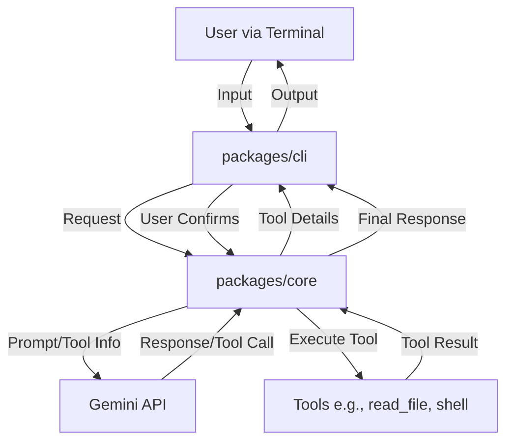

# Gemini CLI Architecture Overview

This document provides a high-level overview of the Gemini CLI's architecture. Understanding the main components and their interactions can be helpful for both users and developers.

## Core Components

The Gemini CLI is primarily composed of two main packages, along with a suite of tools that the system utilizes:

1.  **CLI Package (`packages/cli`):**

    - **Purpose:** This is the user-facing component. It provides the interactive command-line interface (REPL), handles user input, displays output from Gemini, and manages the overall user experience.
    - **Key Features:**
      - Input processing (parsing commands, text prompts).
      - History management.
      - Display rendering (including Markdown, code highlighting, and tool messages).
      - Theme and UI customization.
      - Communication with the Core package.
      - Manages user configuration settings specific to the CLI.

2.  **Core Package (`packages/core`):**

    - **Purpose:** This acts as the backend for the CLI. It receives requests from the CLI, orchestrates interactions with the Gemini API, and manages the execution of available tools.
    - **Key Features:**
      - API client for communicating with the Google Gemini API.
      - Prompt construction and management.
      - Tool registration and execution logic.
      - State management for conversations or sessions.
      - Manages server-side configuration.

3.  **Tools (`packages/core/src/tools/`):**
    - **Purpose:** These are individual modules that extend the capabilities of the Gemini model, allowing it to interact with the local environment (e.g., file system, shell commands, web fetching).
    - **Interaction:** The Core package invokes these tools based on requests from the Gemini model. The CLI then displays the results of tool execution.

## Interaction Flow

A typical interaction with the Gemini CLI follows this general flow:

1.  **User Input:** The user types a prompt or command into the CLI (`packages/cli`).
2.  **Request to Core:** The CLI package sends the user's input to the Core package (`packages/core`).
3.  **Core Processes Request:** The Core package:
    - Constructs an appropriate prompt for the Gemini API, possibly including conversation history and available tool definitions.
    - Sends the prompt to the Gemini API.
4.  **Gemini API Response:** The Gemini API processes the prompt and returns a response. This response might be a direct answer or a request to use one of the available tools.
5.  **Tool Execution (if applicable):**
    - If the Gemini API requests a tool, the Core package prepares to execute it.
    - **User Confirmation for Potentially Impactful Tools:** If the requested tool can modify the file system (e.g., file edits, writes) or execute shell commands, the CLI (`packages/cli`) displays a confirmation prompt to the user. This prompt details the tool and its arguments, and the user must approve the execution. Read-only operations (e.g., reading files, listing directories) may not always require this explicit confirmation step.
    - If confirmed (or if confirmation is not required for the specific tool), the Core package identifies and executes the relevant tool (e.g., `read_file`, `execute_bash_command`).
    - The tool performs its action (e.g., reads a file from the disk).
    - The result of the tool execution is sent back to the Gemini API by the Core.
    - The Gemini API processes the tool result and generates a final response.
6.  **Response to CLI:** The Core package sends the final response (or intermediate tool messages) back to the CLI package.
7.  **Display to User:** The CLI package formats and displays the response to the user in the terminal.

## Diagram (Conceptual)

## Key Design Principles

- **Modularity:** Separating the CLI (frontend) from the Core (backend) allows for independent development and potential future extensions (e.g., different frontends for the same server).
- **Extensibility:** The tool system is designed to be extensible, allowing new capabilities to be added.
- **User Experience:** The CLI focuses on providing a rich and interactive terminal experience.

This overview should provide a foundational understanding of the Gemini CLI's architecture. For more detailed information, refer to the specific documentation for each package and the development guides.
