# Themes

Gemini CLI supports a variety of themes to customize its color scheme and appearance. You can change the theme to suit your preferences via the `/theme` command or `"theme":` configuration setting.

## Available Themes

Gemini CLI comes with a selection of pre-defined themes, which you can list using the `/theme` command within Gemini CLI:

- **Dark Themes:**
  - `ANSI`
  - `Atom One`
  - `Ayu`
  - `Default`
  - `Dracula`
  - `GitHub`
- **Light Themes:**
  - `ANSI Light`
  - `Ayu Light`
  - `Default Light`
  - `GitHub Light`
  - `Google Code`
  - `Xcode`

### Changing Themes

1.  Enter `/theme` into Gemini CLI.
2.  A dialog or selection prompt appears, listing the available themes.
3.  Using the arrow keys, select a theme. Some interfaces might offer a live preview or highlight as you select.
4.  Confirm your selection to apply the theme.

### Theme Persistence

Selected themes are saved in Gemini CLI's [configuration](./configuration.md) so your preference is remembered across sessions.

---

## Custom Color Themes

Gemini CLI allows you to create your own custom color themes by specifying them in your `settings.json` file. This gives you full control over the color palette used in the CLI.

### How to Define a Custom Theme

Add a `customThemes` block to your user, project, or system `settings.json` file. Each custom theme is defined as an object with a unique name and a set of color keys. For example:

```json
{
  "customThemes": {
    "MyCustomTheme": {
      "name": "MyCustomTheme",
      "type": "custom",
      "Background": "#181818",
      "Foreground": "#F8F8F2",
      "LightBlue": "#82AAFF",
      "AccentBlue": "#61AFEF",
      "AccentPurple": "#C678DD",
      "AccentCyan": "#56B6C2",
      "AccentGreen": "#98C379",
      "AccentYellow": "#E5C07B",
      "AccentRed": "#E06C75",
      "Comment": "#5C6370",
      "Gray": "#ABB2BF",
      "DiffAdded": "#A6E3A1",
      "DiffRemoved": "#F38BA8",
      "DiffModified": "#89B4FA",
      "GradientColors": ["#4796E4", "#847ACE", "#C3677F"]
    }
  }
}
```

**Color keys:**

- `Background`
- `Foreground`
- `LightBlue`
- `AccentBlue`
- `AccentPurple`
- `AccentCyan`
- `AccentGreen`
- `AccentYellow`
- `AccentRed`
- `Comment`
- `Gray`
- `DiffAdded` (optional, for added lines in diffs)
- `DiffRemoved` (optional, for removed lines in diffs)
- `DiffModified` (optional, for modified lines in diffs)

**Required Properties:**

- `name` (must match the key in the `customThemes` object and be a string)
- `type` (must be the string `"custom"`)
- `Background`
- `Foreground`
- `LightBlue`
- `AccentBlue`
- `AccentPurple`
- `AccentCyan`
- `AccentGreen`
- `AccentYellow`
- `AccentRed`
- `Comment`
- `Gray`

You can use either hex codes (e.g., `#FF0000`) **or** standard CSS color names (e.g., `coral`, `teal`, `blue`) for any color value. See [CSS color names](https://developer.mozilla.org/en-US/docs/Web/CSS/color_value#color_keywords) for a full list of supported names.

You can define multiple custom themes by adding more entries to the `customThemes` object.

### Example Custom Theme

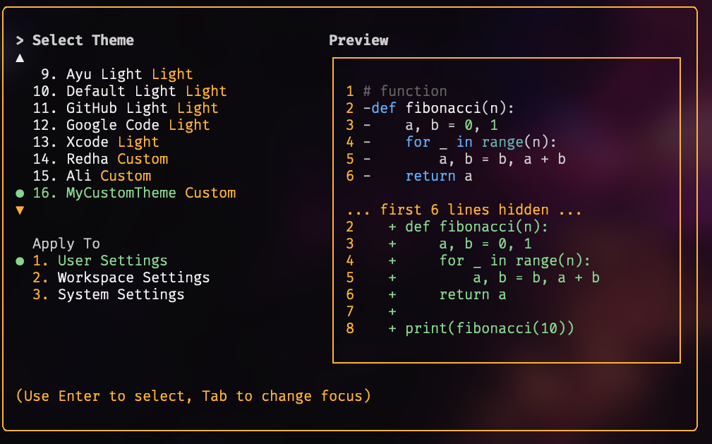

### Using Your Custom Theme

- Select your custom theme using the `/theme` command in Gemini CLI. Your custom theme will appear in the theme selection dialog.
- Or, set it as the default by adding `"theme": "MyCustomTheme"` to your `settings.json`.
- Custom themes can be set at the user, project, or system level, and follow the same [configuration precedence](./configuration.md) as other settings.

---

## Dark Themes

### ANSI

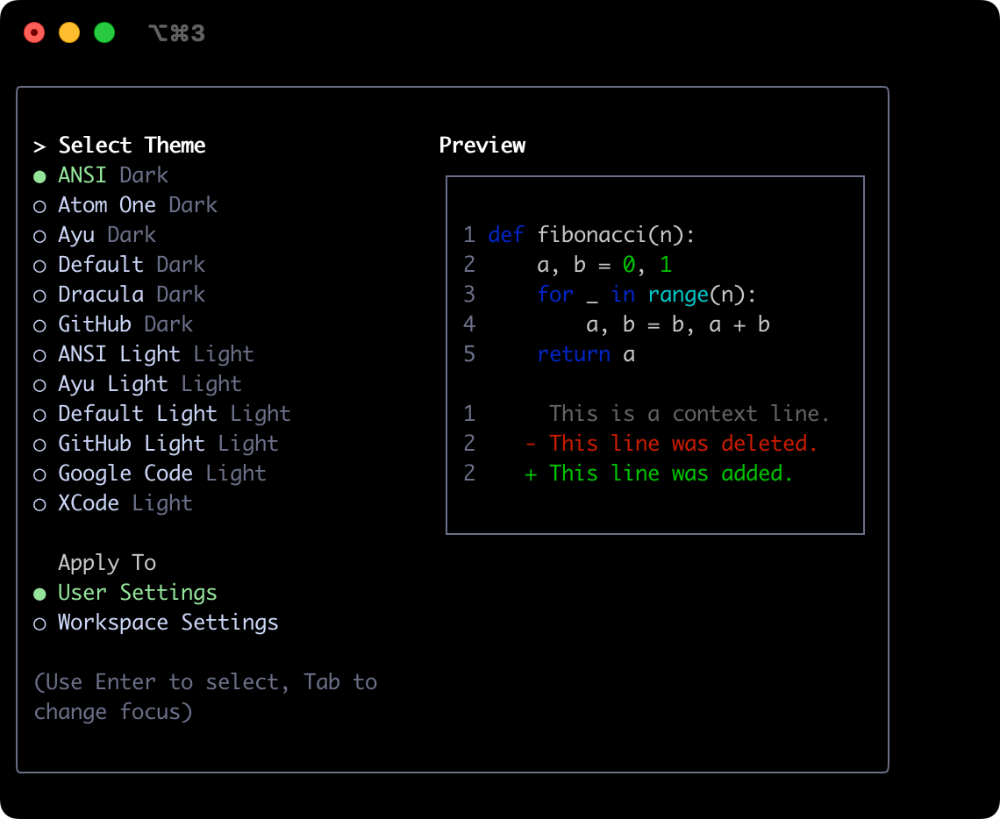

### Atom OneDark


### Ayu

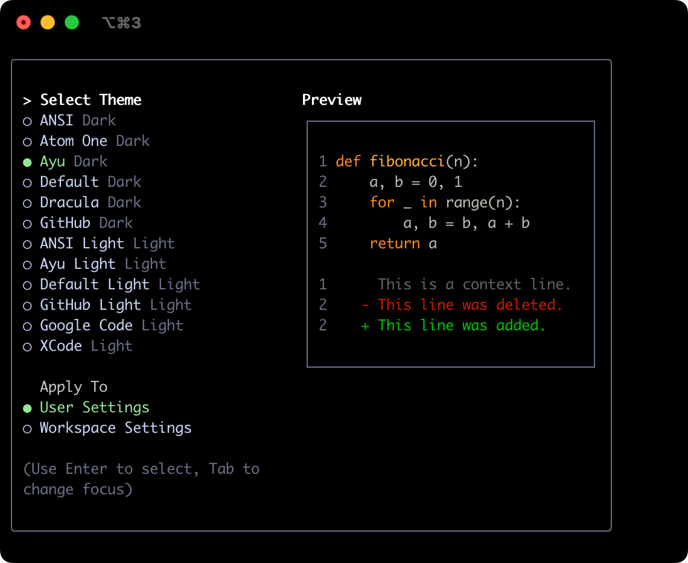

### Default

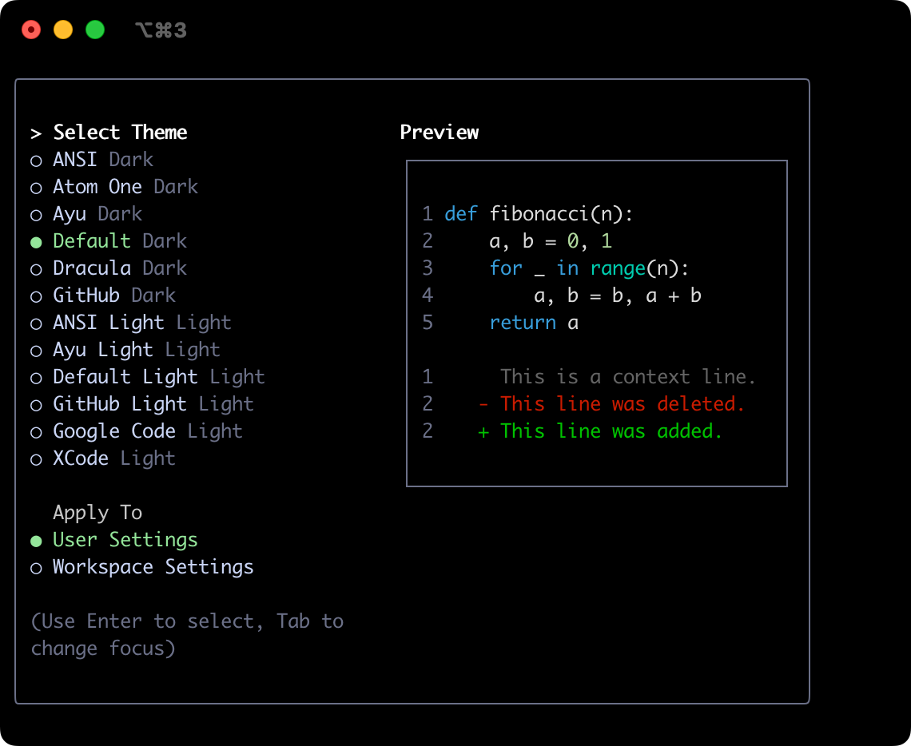

### Dracula

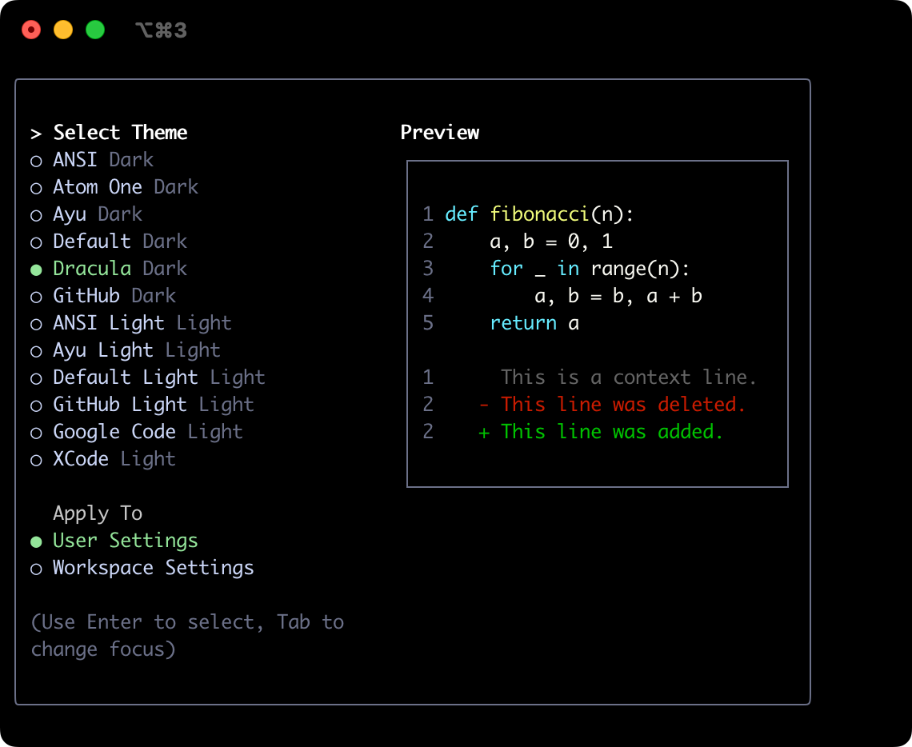

### GitHub


## Light Themes

### ANSI Light

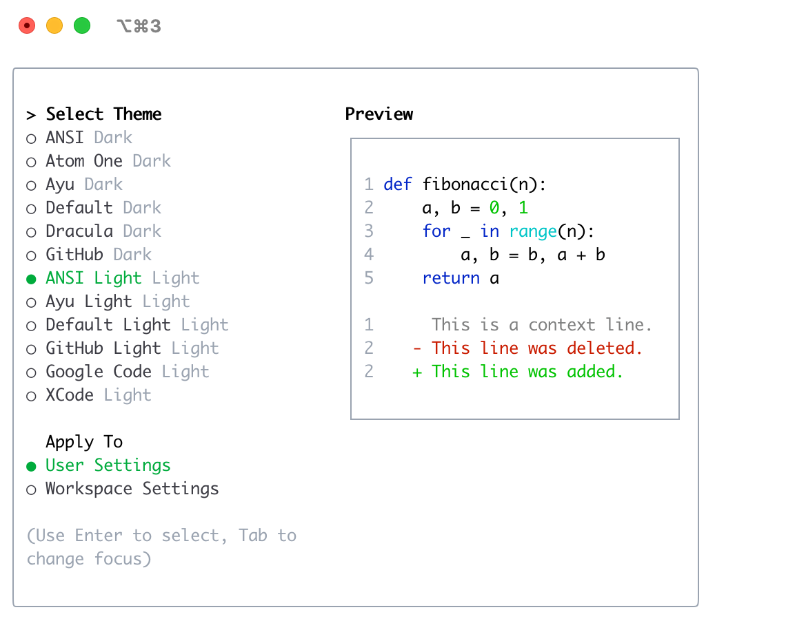

### Ayu Light

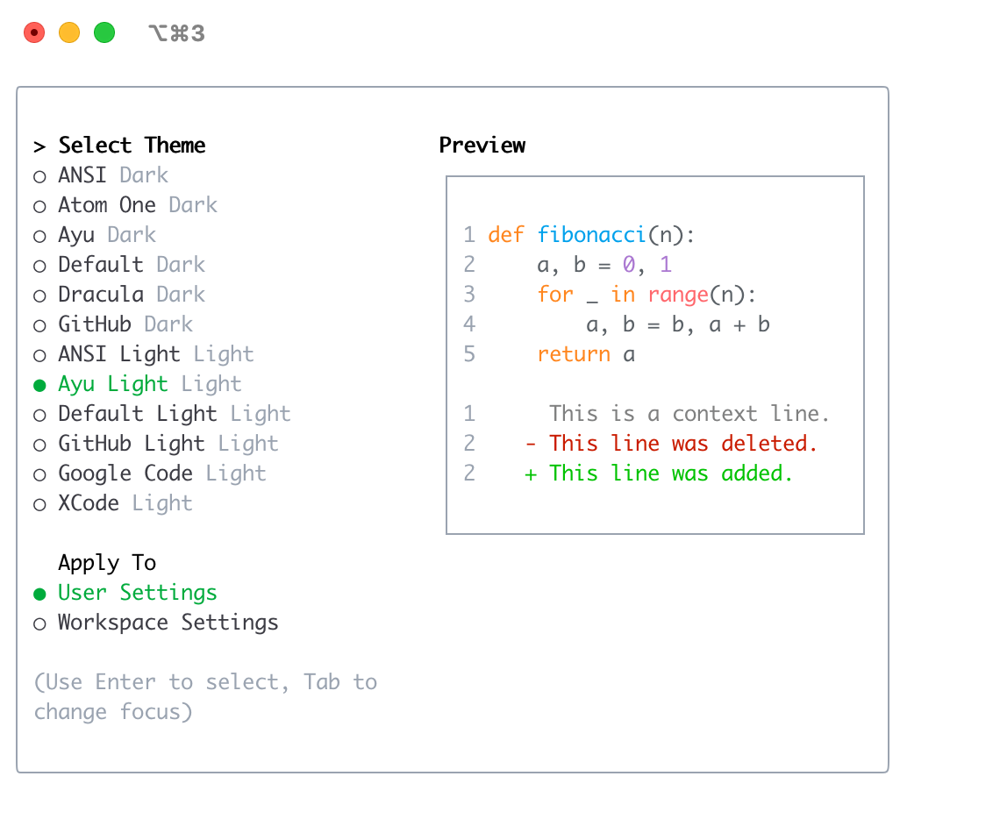

### Default Light

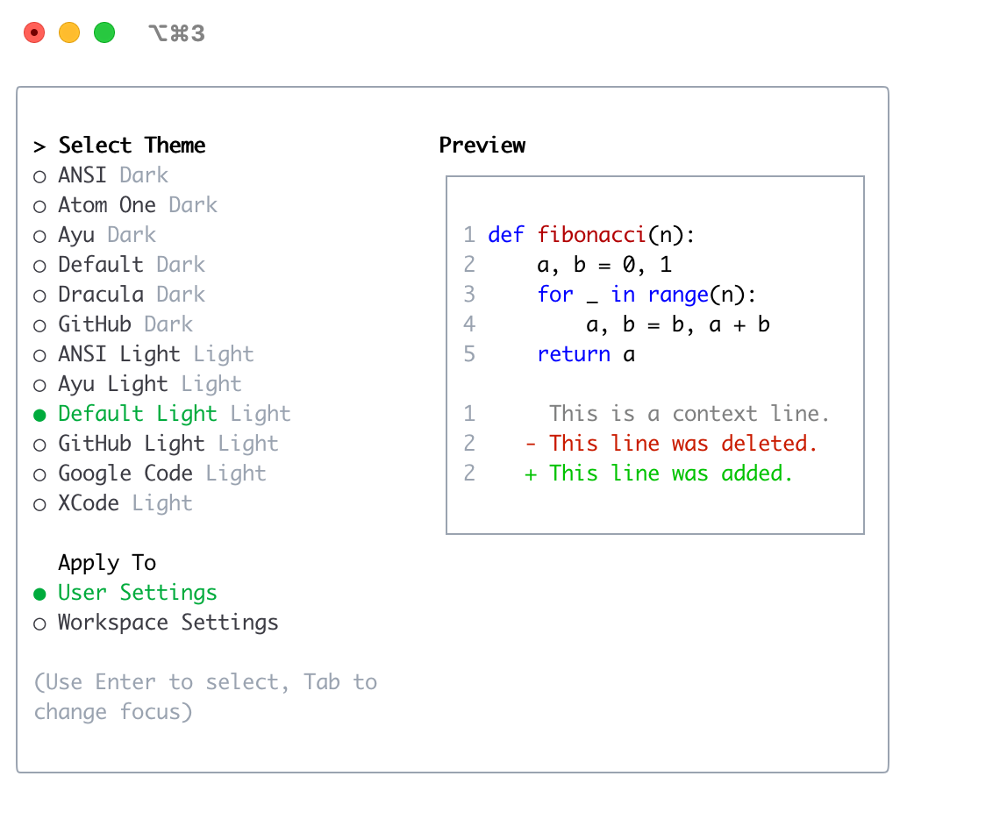

### GitHub Light

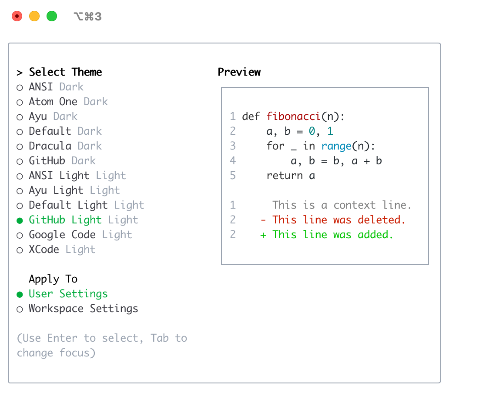

### Google Code

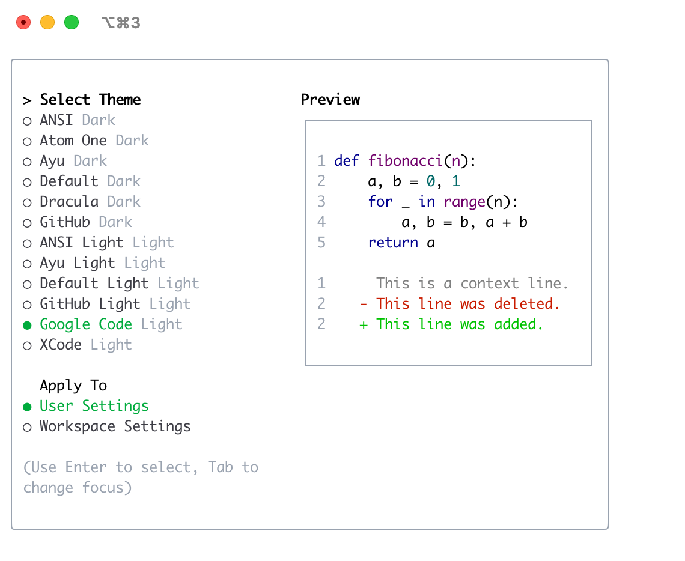

### Xcode

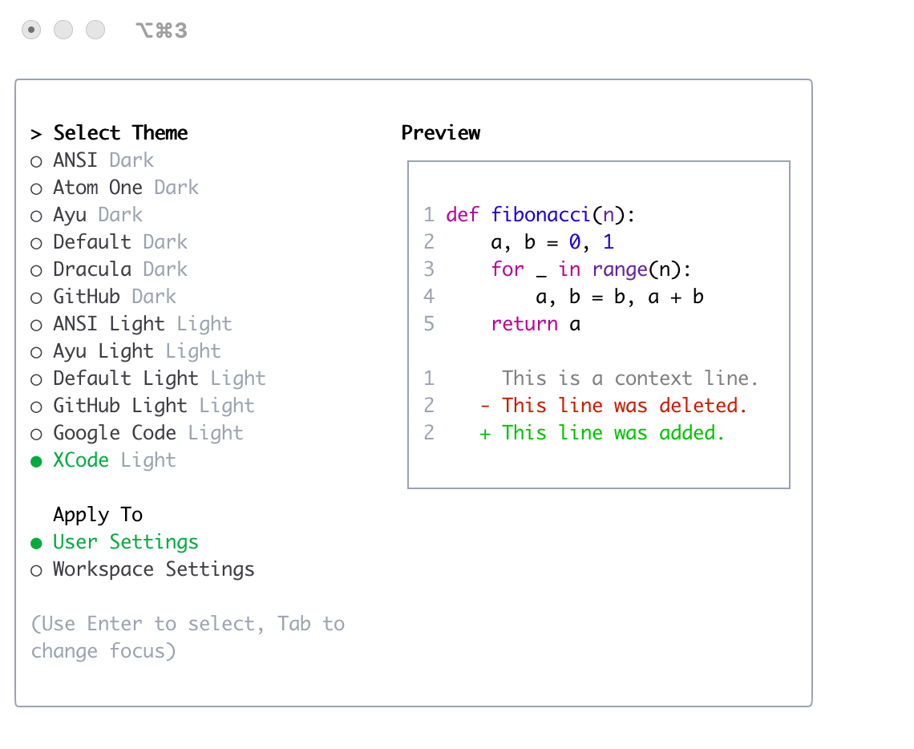
