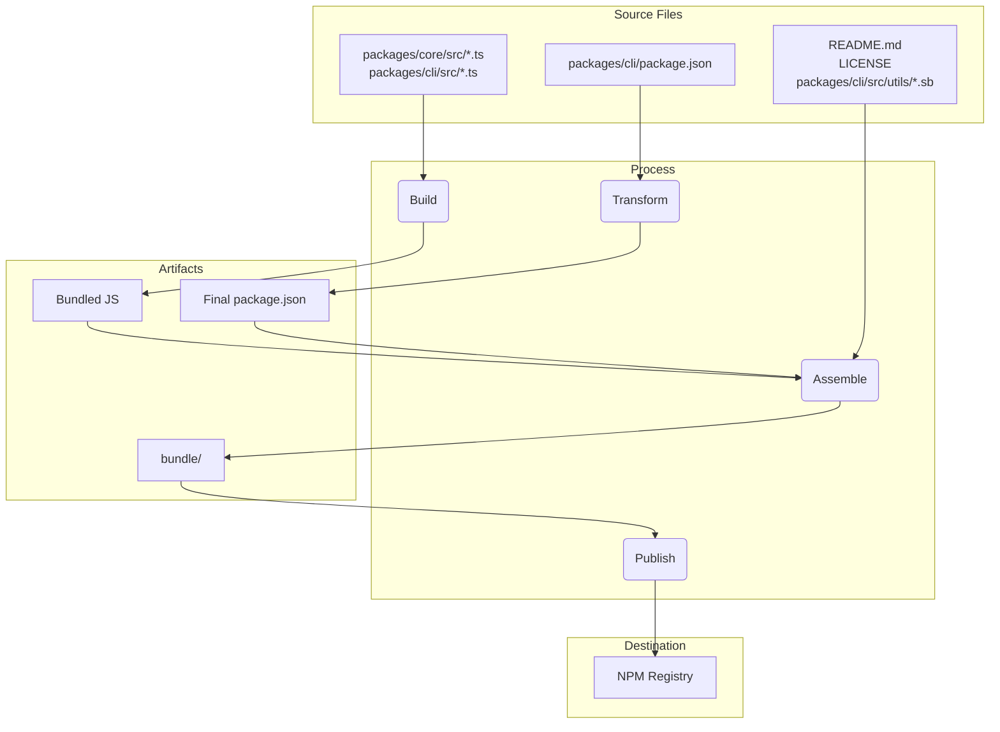

# Package Overview

This monorepo contains two main packages: `@google/gemini-cli` and `@google/gemini-cli-core`.

## `@google/gemini-cli`

This is the main package for the Gemini CLI. It is responsible for the user interface, command parsing, and all other user-facing functionality.

When this package is published, it is bundled into a single executable file. This bundle includes all of the package's dependencies, including `@google/gemini-cli-core`. This means that whether a user installs the package with `npm install -g @google/gemini-cli` or runs it directly with `npx @google/gemini-cli`, they are using this single, self-contained executable.

## `@google/gemini-cli-core`

This package contains the core logic for interacting with the Gemini API. It is responsible for making API requests, handling authentication, and managing the local cache.

This package is not bundled. When it is published, it is published as a standard Node.js package with its own dependencies. This allows it to be used as a standalone package in other projects, if needed. All transpiled js code in the `dist` folder is included in the package.

# Release Process

This project follows a structured release process to ensure that all packages are versioned and published correctly. The process is designed to be as automated as possible.

## How To Release

Releases are managed through the [release.yml](https://github.com/google-gemini/gemini-cli/actions/workflows/release.yml) GitHub Actions workflow. To perform a manual release for a patch or hotfix:

1.  Navigate to the **Actions** tab of the repository.
2.  Select the **Release** workflow from the list.
3.  Click the **Run workflow** dropdown button.
4.  Fill in the required inputs:
    - **Version**: The exact version to release (e.g., `v0.2.1`).
    - **Ref**: The branch or commit SHA to release from (defaults to `main`).
    - **Dry Run**: Leave as `true` to test the workflow without publishing, or set to `false` to perform a live release.
5.  Click **Run workflow**.

## Nightly Releases

In addition to manual releases, this project has an automated nightly release process to provide the latest "bleeding edge" version for testing and development.

### Process

Every night at midnight UTC, the [Release workflow](https://github.com/google-gemini/gemini-cli/actions/workflows/release.yml) runs automatically on a schedule. It performs the following steps:

1.  Checks out the latest code from the `main` branch.
2.  Installs all dependencies.
3.  Runs the full suite of `preflight` checks and integration tests.
4.  If all tests succeed, it calculates the next nightly version number (e.g., `v0.2.1-nightly.20230101`).
5.  It then builds and publishes the packages to npm with the `nightly` dist-tag.
6.  Finally, it creates a GitHub Release for the nightly version.

### Failure Handling

If any step in the nightly workflow fails, it will automatically create a new issue in the repository with the labels `bug` and `nightly-failure`. The issue will contain a link to the failed workflow run for easy debugging.

### How to Use the Nightly Build

To install the latest nightly build, use the `@nightly` tag:

```bash
npm install -g @google/gemini-cli@nightly
```

We also run a Google cloud build called [release-docker.yml](../.gcp/release-docker.yaml). Which publishes the sandbox docker to match your release. This will also be moved to GH and combined with the main release file once service account permissions are sorted out.

### After the Release

After the workflow has successfully completed, you can monitor its progress in the [GitHub Actions tab](https://github.com/google-gemini/gemini-cli/actions/workflows/release.yml). Once complete, you should:

1.  Go to the [pull requests page](https://github.com/google-gemini/gemini-cli/pulls) of the repository.
2.  Create a new pull request from the `release/vX.Y.Z` branch to `main`.
3.  Review the pull request (it should only contain version updates in `package.json` files) and merge it. This keeps the version in `main` up-to-date.

## Release Validation

After pushing a new release smoke testing should be performed to ensure that the packages are working as expected. This can be done by installing the packages locally and running a set of tests to ensure that they are functioning correctly.

- `npx -y @google/gemini-cli@latest --version` to validate the push worked as expected if you were not doing a rc or dev tag
- `npx -y @google/gemini-cli@<release tag> --version` to validate the tag pushed appropriately
- _This is destructive locally_ `npm uninstall @google/gemini-cli && npm uninstall -g @google/gemini-cli && npm cache clean --force &&  npm install @google/gemini-cli@<version>`
- Smoke testing a basic run through of exercising a few llm commands and tools is recommended to ensure that the packages are working as expected. We'll codify this more in the future.

## When to merge the version change, or not?

The above pattern for creating patch or hotfix releases from current or older commits leaves the repository in the following state:

1.  The Tag (`vX.Y.Z-patch.1`): This tag correctly points to the original commit on main
    that contains the stable code you intended to release. This is crucial. Anyone checking
    out this tag gets the exact code that was published.
2.  The Branch (`release-vX.Y.Z-patch.1`): This branch contains one new commit on top of the
    tagged commit. That new commit only contains the version number change in package.json
    (and other related files like package-lock.json).

This separation is good. It keeps your main branch history clean of release-specific
version bumps until you decide to merge them.

This is the critical decision, and it depends entirely on the nature of the release.

### Merge Back for Stable Patches and Hotfixes

You almost always want to merge the `release-<tag>` branch back into `main` for any
stable patch or hotfix release.

- Why? The primary reason is to update the version in main's package.json. If you release
  v1.2.1 from an older commit but never merge the version bump back, your main branch's
  package.json will still say "version": "1.2.0". The next developer who starts work for
  the next feature release (v1.3.0) will be branching from a codebase that has an
  incorrect, older version number. This leads to confusion and requires manual version
  bumping later.
- The Process: After the release-v1.2.1 branch is created and the package is successfully
  published, you should open a pull request to merge release-v1.2.1 into main. This PR
  will contain just one commit: "chore: bump version to v1.2.1". It's a clean, simple
  integration that keeps your main branch in sync with the latest released version.

### Do NOT Merge Back for Pre-Releases (RC, Beta, Dev)

You typically do not merge release branches for pre-releases back into `main`.

- Why? Pre-release versions (e.g., v1.3.0-rc.1, v1.3.0-rc.2) are, by definition, not
  stable and are temporary. You don't want to pollute your main branch's history with a
  series of version bumps for release candidates. The package.json in main should reflect
  the latest stable release version, not an RC.
- The Process: The release-v1.3.0-rc.1 branch is created, the npm publish --tag rc happens,
  and then... the branch has served its purpose. You can simply delete it. The code for
  the RC is already on main (or a feature branch), so no functional code is lost. The
  release branch was just a temporary vehicle for the version number.

## Local Testing and Validation: Changes to the Packaging and Publishing Process

If you need to test the release process without actually publishing to NPM or creating a public GitHub release, you can trigger the workflow manually from the GitHub UI.

1.  Go to the [Actions tab](https://github.com/google-gemini/gemini-cli/actions/workflows/release.yml) of the repository.
2.  Click on the "Run workflow" dropdown.
3.  Leave the `dry_run` option checked (`true`).
4.  Click the "Run workflow" button.

This will run the entire release process but will skip the `npm publish` and `gh release create` steps. You can inspect the workflow logs to ensure everything is working as expected.

It is crucial to test any changes to the packaging and publishing process locally before committing them. This ensures that the packages will be published correctly and that they will work as expected when installed by a user.

To validate your changes, you can perform a dry run of the publishing process. This will simulate the publishing process without actually publishing the packages to the npm registry.

```bash
npm_package_version=9.9.9 SANDBOX_IMAGE_REGISTRY="registry" SANDBOX_IMAGE_NAME="thename" npm run publish:npm --dry-run
```

This command will do the following:

1.  Build all the packages.
2.  Run all the prepublish scripts.
3.  Create the package tarballs that would be published to npm.
4.  Print a summary of the packages that would be published.

You can then inspect the generated tarballs to ensure that they contain the correct files and that the `package.json` files have been updated correctly. The tarballs will be created in the root of each package's directory (e.g., `packages/cli/google-gemini-cli-0.1.6.tgz`).

By performing a dry run, you can be confident that your changes to the packaging process are correct and that the packages will be published successfully.

## Release Deep Dive

The main goal of the release process is to take the source code from the packages/ directory, build it, and assemble a
clean, self-contained package in a temporary `bundle` directory at the root of the project. This `bundle` directory is what
actually gets published to NPM.

Here are the key stages:

Stage 1: Pre-Release Sanity Checks and Versioning

- What happens: Before any files are moved, the process ensures the project is in a good state. This involves running tests,
  linting, and type-checking (npm run preflight). The version number in the root package.json and packages/cli/package.json
  is updated to the new release version.
- Why: This guarantees that only high-quality, working code is released. Versioning is the first step to signify a new
  release.

Stage 2: Building the Source Code

- What happens: The TypeScript source code in packages/core/src and packages/cli/src is compiled into JavaScript.
- File movement:
  - packages/core/src/\*_/_.ts -> compiled to -> packages/core/dist/
  - packages/cli/src/\*_/_.ts -> compiled to -> packages/cli/dist/
- Why: The TypeScript code written during development needs to be converted into plain JavaScript that can be run by
  Node.js. The core package is built first as the cli package depends on it.

Stage 3: Assembling the Final Publishable Package

This is the most critical stage where files are moved and transformed into their final state for publishing. A temporary
`bundle` folder is created at the project root to house the final package contents.

1.  The `package.json` is Transformed:
    - What happens: The package.json from packages/cli/ is read, modified, and written into the root `bundle`/ directory.
    - File movement: packages/cli/package.json -> (in-memory transformation) -> `bundle`/package.json
    - Why: The final package.json must be different from the one used in development. Key changes include:
      - Removing devDependencies.
      - Removing workspace-specific "dependencies": { "@gemini-cli/core": "workspace:\*" } and ensuring the core code is
        bundled directly into the final JavaScript file.
      - Ensuring the bin, main, and files fields point to the correct locations within the final package structure.

2.  The JavaScript Bundle is Created:
    - What happens: The built JavaScript from both packages/core/dist and packages/cli/dist are bundled into a single,
      executable JavaScript file.
    - File movement: packages/cli/dist/index.js + packages/core/dist/index.js -> (bundled by esbuild) -> `bundle`/gemini.js (or a
      similar name).
    - Why: This creates a single, optimized file that contains all the necessary application code. It simplifies the package
      by removing the need for the core package to be a separate dependency on NPM, as its code is now included directly.

3.  Static and Supporting Files are Copied:
    - What happens: Essential files that are not part of the source code but are required for the package to work correctly
      or be well-described are copied into the `bundle` directory.
    - File movement:
      - README.md -> `bundle`/README.md
      - LICENSE -> `bundle`/LICENSE
      - packages/cli/src/utils/\*.sb (sandbox profiles) -> `bundle`/
    - Why:
      - The README.md and LICENSE are standard files that should be included in any NPM package.
      - The sandbox profiles (.sb files) are critical runtime assets required for the CLI's sandboxing feature to
        function. They must be located next to the final executable.

Stage 4: Publishing to NPM

- What happens: The npm publish command is run from inside the root `bundle` directory.
- Why: By running npm publish from within the `bundle` directory, only the files we carefully assembled in Stage 3 are uploaded
  to the NPM registry. This prevents any source code, test files, or development configurations from being accidentally
  published, resulting in a clean and minimal package for users.

Summary of File Flow



This process ensures that the final published artifact is a purpose-built, clean, and efficient representation of the
project, rather than a direct copy of the development workspace.

## NPM Workspaces

This project uses [NPM Workspaces](https://docs.npmjs.com/cli/v10/using-npm/workspaces) to manage the packages within this monorepo. This simplifies development by allowing us to manage dependencies and run scripts across multiple packages from the root of the project.

### How it Works

The root `package.json` file defines the workspaces for this project:

```json
{
  "workspaces": ["packages/*"]
}
```

This tells NPM that any folder inside the `packages` directory is a separate package that should be managed as part of the workspace.

### Benefits of Workspaces

- **Simplified Dependency Management**: Running `npm install` from the root of the project will install all dependencies for all packages in the workspace and link them together. This means you don't need to run `npm install` in each package's directory.
- **Automatic Linking**: Packages within the workspace can depend on each other. When you run `npm install`, NPM will automatically create symlinks between the packages. This means that when you make changes to one package, the changes are immediately available to other packages that depend on it.
- **Simplified Script Execution**: You can run scripts in any package from the root of the project using the `--workspace` flag. For example, to run the `build` script in the `cli` package, you can run `npm run build --workspace @google/gemini-cli`.
